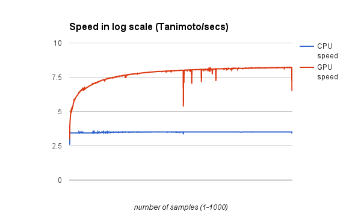
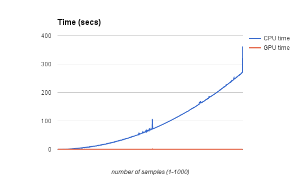

# bigchem
Software for processing large scale chemistry data

## Intro
Welcome. This code is the result of a software engineering class project at the University of North Carolina at Chapel Hill. It was designed to compare sets of molecules to each other with high throughput by utilizing general purpose GPU computing.

## Dependencies

_This code will not run without a CUDA-capable GPU._

This package relies on the following and libraries:

* [pyCUDA](http://wiki.tiker.net/PyCuda/Installation)
* [numpy](http://www.scipy.org/install.html)

## Install
After installing the dependencies, download this entire repository. All pyCUDA functions are contained in `gpu_tanimoto_popcount.py`. Copy this file into the same directory as the program that needs to use it.

## Demo
To test that all the modules are working, run `demo.py` in the demo directory. This script compares 50,000 x 50,000 molecules. 

## Input
Input molecules are formatted into their bitstring representations. For an example, see demo/bitstring-hex-encode.py

# Results
In sum, we made the speed improve by 5 in log scale in our benchmark.

